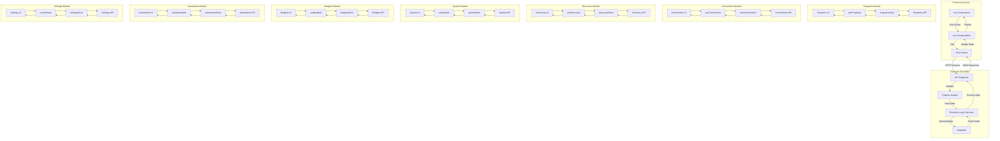

```mermaid
graph TD
    %% Frontend Components
    subgraph "Frontend (Vue.js)"
        UI[Vue Components]
        Composables[Vue Composables]
        Stores[Pinia Stores]
    end

    %% Backend Components
    subgraph "Backend (FastAPI)"
        API[API Endpoints]
        Models[Pydantic Models]
        Services[Business Logic Services]
        DB[Database]
    end

    %% Data Flow
    UI -->|User Action| Composables
    Composables -->|Call| Stores
    Stores -->|HTTP Request| API
    API -->|Validate| Models
    Models -->|Pass Data| Services
    Services -->|Query/Update| DB
    DB -->|Return Data| Services
    Services -->|Process Data| API
    API -->|JSON Response| Stores
    Stores -->|Update State| Composables
    Composables -->|Render| UI

    %% Module Connections
    subgraph "Programs Module"
        UI_Programs[Programs UI]
        Comp_Programs[usePrograms]
        Store_Programs[programsStore]
        API_Programs[Programs API]
    end

    subgraph "Connections Module"
        UI_Connections[Connections UI]
        Comp_Connections[useConnections]
        Store_Connections[connectionsStore]
        API_Connections[Connections API]
    end

    subgraph "Discovery Module"
        UI_Discovery[Discovery UI]
        Comp_Discovery[useDiscovery]
        Store_Discovery[discoveryStore]
        API_Discovery[Discovery API]
    end

    subgraph "System Module"
        UI_System[System UI]
        Comp_System[useSystem]
        Store_System[systemStore]
        API_System[System API]
    end

    subgraph "Budgets Module"
        UI_Budgets[Budgets UI]
        Comp_Budgets[useBudgets]
        Store_Budgets[budgetsStore]
        API_Budgets[Budgets API]
    end

    subgraph "Automation Module"
        UI_Automation[Automation UI]
        Comp_Automation[useAutomation]
        Store_Automation[automationStore]
        API_Automation[Automation API]
    end

    subgraph "Settings Module"
        UI_Settings[Settings UI]
        Comp_Settings[useSettings]
        Store_Settings[settingsStore]
        API_Settings[Settings API]
    end

    %% Module-specific flows
    UI_Programs --> Comp_Programs
    Comp_Programs --> Store_Programs
    Store_Programs --> API_Programs
    API_Programs --> Store_Programs
    Store_Programs --> Comp_Programs
    Comp_Programs --> UI_Programs

    UI_Connections --> Comp_Connections
    Comp_Connections --> Store_Connections
    Store_Connections --> API_Connections
    API_Connections --> Store_Connections
    Store_Connections --> Comp_Connections
    Comp_Connections --> UI_Connections

    UI_Discovery --> Comp_Discovery
    Comp_Discovery --> Store_Discovery
    Store_Discovery --> API_Discovery
    API_Discovery --> Store_Discovery
    Store_Discovery --> Comp_Discovery
    Comp_Discovery --> UI_Discovery

    UI_System --> Comp_System
    Comp_System --> Store_System
    Store_System --> API_System
    API_System --> Store_System
    Store_System --> Comp_System
    Comp_System --> UI_System

    UI_Budgets --> Comp_Budgets
    Comp_Budgets --> Store_Budgets
    Store_Budgets --> API_Budgets
    API_Budgets --> Store_Budgets
    Store_Budgets --> Comp_Budgets
    Comp_Budgets --> UI_Budgets

    UI_Automation --> Comp_Automation
    Comp_Automation --> Store_Automation
    Store_Automation --> API_Automation
    API_Automation --> Store_Automation
    Store_Automation --> Comp_Automation
    Comp_Automation --> UI_Automation

    UI_Settings --> Comp_Settings
    Comp_Settings --> Store_Settings
    Store_Settings --> API_Settings
    API_Settings --> Store_Settings
    Store_Settings --> Comp_Settings
    Comp_Settings --> UI_Settings
```
